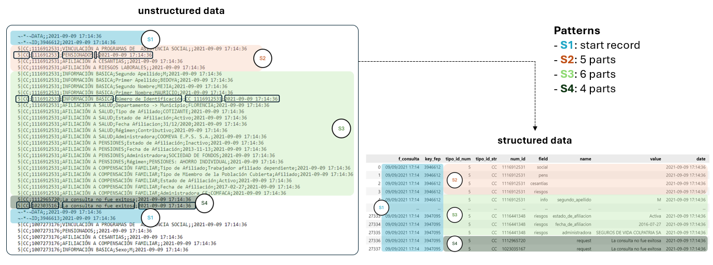

# RUAF Data Structuring

## Index
1. [Introduction](#introduction)
2. [Solution strategy](#solution-strategy)
3. [Repository structure](#repository-structure)


## Introduction
### Context
In Colombia, RUAF refers to the **Unique Registry of Affiliates**. It is a database managed by the Administrator of the Resources of the General System of Social Security in Health (ADRES). This registry contains information about individuals affiliated with the health system, including personal data and details about their affiliation and coverage.

RUAF enables data centralization, transparency, and control, manages affiliations, and facilitates administrative processes. Therefore, it is a key tool for managing the health system in Colombia, providing a comprehensive and up-to-date view of health system affiliation.

### Project Goal 
The starting point is a CSV file with unstructured RUAF data. The goal is to transform and structure this data based on the detailed instructions provided below and an accompanying [XLSX guide](data/raw/muestra_estructurada_RUAF.xlsx)

* Records begin with “¬-*-¬DATA”.
* Data is organized by sections, but these sections should not appear in the final table.
* If a record lacks information, add a “marca_sin_informacion” field with 0 for information present and 1 for no information.
* Fields should use snake_case notation

## Solution strategy

### First stage

An analysis of the raw data was conducted to identify structures and search patterns. Four repetitive sections of constant length were found. With this in mind, the objective of the first stage is to **transform the unstructured raw data into a structured format**, ensuring data uniqueness and consistency for future transformations.



The transformation process is carried out in the **intermediate pipeline**. This pipeline receives the raw file, reads it line by line, identifies the start pattern of each record, and extracts the data contained in each section. Using pandas, a dataframe is created with the columns indicated in the 'structured data' section of the previous diagram.

The function stores a CSV in the intermediate data stage to persist historical data and returns the dataframe for the next stage.

## Repository structure

```linux

.
├── data                               # data storage in stages
│   │── raw
│   │── intermediate                   # data output from intermediate pipeline
│   └── mart
├── src                                # contains the work scripts
│   │── functions.py
│   └── int_pipeline.py
├── resources                          # contains no binary files for docs
├── .env                               # contains the environment variables
│
└── requirements.txt                   

```


