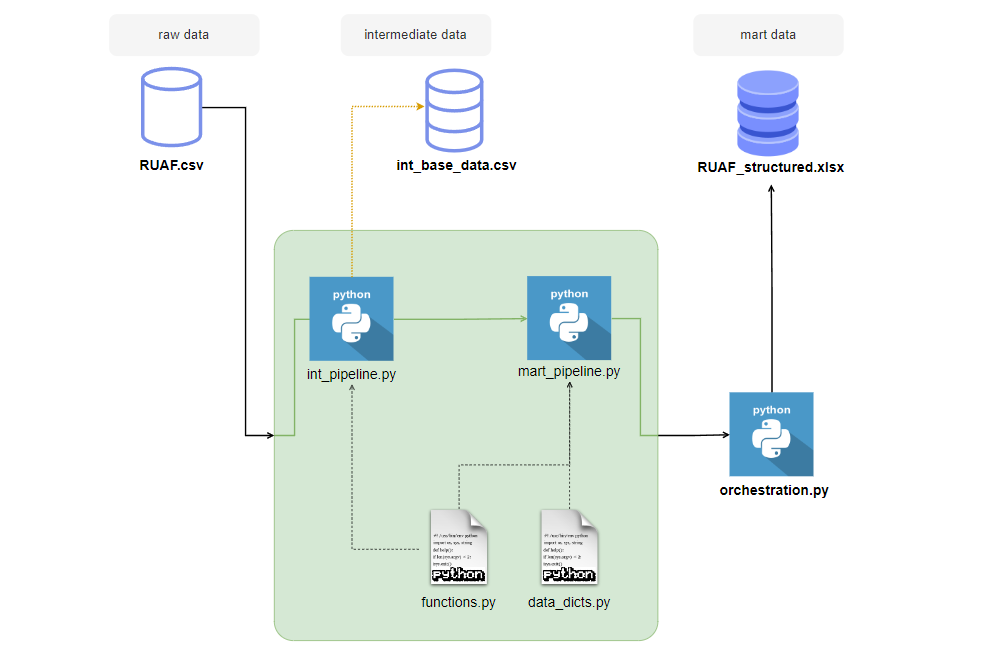

# RUAF Data Structuring

## Index
1. [Introduction](#introduction)
2. [Solution strategy](#solution-strategy)
3. [Technical solution](#technical-solution)
4. [Project structure](#project-structure)
5. [Configuration](#configuration)


## Introduction
### Context
In Colombia, RUAF refers to the **Unique Registry of Affiliates**. It is a database managed by the Administrator of the Resources of the General System of Social Security in Health (ADRES). This registry contains information about individuals affiliated with the health system, including personal data and details about their affiliation and coverage.

RUAF enables data centralization, transparency, and control, manages affiliations, and facilitates administrative processes. Therefore, it is a key tool for managing the health system in Colombia, providing a comprehensive and up-to-date view of health system affiliation.

### Project Goal 
The starting point is a CSV file with unstructured RUAF data. The goal is to transform and structure this data based on the detailed instructions provided below and an accompanying [XLSX guide](data/raw/muestra_estructurada_RUAF.xlsx)

* Records begin with “¬-*-¬DATA”.
* Data is organized by sections, but these sections should not appear in the final table.
* If a record lacks information, add a “marca_sin_informacion” field with 0 for information present and 1 for no information.
* Fields should use snake_case notation

## Solution strategy

### First stage
An analysis of the raw data was conducted to identify structures and search patterns. Four repetitive sections of constant length were found. With this in mind, the objective of the first stage is to **transform the unstructured raw data into a structured format**, ensuring data uniqueness and consistency for future transformations.


The transformation process is carried out in the **intermediate pipeline**. This pipeline receives the raw file, reads it line by line, identifies the start pattern of each record, and extracts the data contained in each section. Using pandas, a dataframe is created with *base columns*, including f_consulta, key_fep, tipo_id_num, num_id, field, value and date

The function stores a CSV in the intermediate data stage to persist historical data and returns the dataframe for the next stage.

### Second stage
The goal at this stage is to perform transformation operations on the DataFrame to achieve the reference format. This stage is divided into three sub-stages: 

1. **Set up intermediate dataframe:** Receives the DataFrame produced by the intermediate pipeline. Normalizes the base columns, separates the first part of tipo_id_num from the second part, adds the second part to a new column called tipo_id_str, and finally creates the aux column as a concatenation of the field and value columns. The resulting aux column will be used in the subsequent sub-stages to generate the columns for the final structure.
The output of this function is: 

2. **Structuring dataframe:** Receives the DataFrame produced by the first sub-stage of the mart pipeline. It retains the base columns defined as a list in the data_dicts.py file, then uses the pivot_table function on the aux column to generate the new DataFrame structure. Finally, it reorders and renames the resulting columns based on the set_up_columns data dictionary provided in the data_dicts.py script.
The output of this function is:

3. **Clean and transform data:** Receives the DataFrame produced by the second sub-stage of the mart pipeline. Performs data cleaning, transformation, and column generation operations to produce the final dataset.

### Third stage
The objective of this stage is, through an orchestrator, to call all the pipeline modules that process and transform the data. The purpose of an orchestrator is to coordinate and manage the execution flow of these modules to ensure that data is processed in the correct sequence and outputted correctly. 

The output of this stage is the goal of this project: [RUAF_structured.xlsx](data/mart/ruaf_structured_first.xlsx). The xlsx file that is stored in the mart stage of the data storage, where it is available to the end user

## Technical solution
The solution involves organizing the data into three stages (raw, intermediate, and mart) to ensure a clear and structured data flow. Utility scripts are created for column operations and data structures, and pipelines are set up for each stage. The orchestration script manages the execution of all pipelines, and environment variables are used to enhance flexibility and adaptability



### Data stages

* **Raw (Bronze):** This stage stores the initial input data for the project.
* **Intermediate** (Silver): This stage holds the initial structured data.
* **Mart (Gold):** This stage contains the final output data of the project.

This staged approach is important because it ensures a clear and organized flow of data transformation and storage, facilitating better data management and processing.

### Scripts and Utilities

* **functions.py:** Contains functions for performing various operations on data columns.
* **data_dicts.py:** Manages data structures to organize and structure the data effectively.

These scripts act as utility scripts and are essential for modular and reusable code.

### Pipelines

A separate pipeline script is proposed for each data stage defined in the solution strategy. These pipelines are responsible for processing and transforming the data at each stage. All scripts are contained within the src directory

### Orchestration

**orchestration.py** is the main function that orchestrates all the pipelines, ensuring they run in the correct sequence. It is crucial because it manages the entire data processing workflow, coordinating the execution of each pipeline and ensuring the final output is correctly generated and stored.

### Access

* **.env:** This file is used to store environment variables, allowing for flexible configuration. If the project needs to be run in a different environment, the variables can be easily modified or added, ensuring adaptability and ease of deployment.

* **run.sh:** Using a setup.sh script is valuable because it automates the setup and execution process, ensuring consistency and saving time. It simplifies the process of creating and activating a virtual environment, installing dependencies, and running the main project scripts, which reduces the risk of human error and makes the project easier to manage and deploy.


## Project structure

```linux

.
├── data                               # data storage in stages
│   │── raw
│   │── intermediate                   # data output from intermediate pipeline
│   └── mart
├── src                                # contains the work scripts
│   │── data_dicts.py                  # stores data structures for manage vars
│   │── functions.py                   # stores functions for column operation
│   │── int_pipeline.py                # transform unstructured data into dataframe
│   └── mart_pipeline.py               # set up columns to reach muestra_estructurada_RUAF
├── resources                          # folder: contains no binary files for docs
├── .env                               # contains the environment variables
├── orchestration.py                   # main orchestration script
├── run.sh                             # automates the setup and execution process
│
├── README.md                          # Project documentation
└── requirements.txt                   

```

## Configuration

### Ensure Prerequisites

Make sure you have the following installed on your system:
```
- Python 3
- Pip (Python package installer)
```

### Clone the Repository

If you haven't already, download or clone the repository to your local machine.

### Running the `setup.sh` Script

1. Open a Git Bash terminal.
2. Grant execution permissions to the `.sh` file with the command `chmod +x setup.sh`.
3. Run the `.sh` file with the command `./setup.sh`.

## Notes

* If you have a file with a structure similar to the proposed one, you should change the path in the environment variables to reflect the correct paths and filenames.
* The `data/marts` folder contains the output from the first run of the project, and its name has been modified by adding '_first' at the end. If you run the project again, the new output will be saved without overwriting the initial file.


